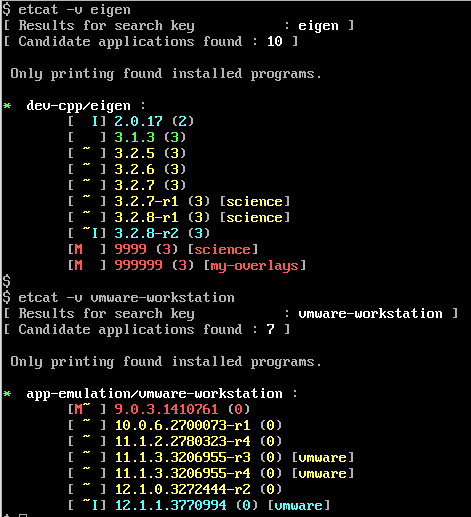

=====
ETCAT
=====

--------
SYNOPSIS
--------
etcat [ options ] [ package ]

-----------
DESCRIPTION
-----------
This is an updated version of **etcat**
that works with the later versions of `gentoolkit <https://wiki.gentoo.org/wiki/Gentoolkit>`_.

**etcat** is an information extraction utility for `Portage <https://wiki.gentoo.org/wiki/Portage>`_ (the Gentoo package
manager) that Gentoo old-timers cannot do without.  

**etcat** used to be part of **gentoolkit** but some years ago it was dropped
in favour of another tool called 
`equery <https://wiki.gentoo.org/wiki/Equery>`_, which, although it is adequate and
offers more functions, it never surpassed the simplicity and clarity of the
colour coded output of **etcat**, particularly when displaying the available
versions of a package. **etcat** is a simple python script that uses only **gentoolkit** functions.   

**etcat** can be used to show the:

* available versions of a package
* changelog of an ebuild
* size of an installed package
* use flags of an ebuild

The functions *belongs*, *depends* and *graph* of the original **etcat** 
have been dropped from this version, where as the -v option now displays 
repo details too.

OPTIONS
+++++++

files (-f short option)
  Lists files that belong to a package and optionally with version.

uses (-u short option)
  Advanced output of USE vars in a package. Tells you flags used by a package
  at time of installation, flags in current configuration and flag description.

versions (-v short option)
  Displays the versions available for a specific package. Colour coded  
  to indicate installation status and displays slot information.
  If the ebuild is from overlay the repository is also displayed (new).

changes (-c short option)
  Outputs the changelog entry to screen. It is possible to give a version 
  number along with the package name.

size (-s short option)
  Lists the installed size of a package.

USAGE
+++++

Make sure that the python script **etcat** is executable and place it 
somewhere in your search path (e.g. in ``/usr/local/bin/`` or ``~/bin/``)    

EXAMPLE
+++++++

``etcat -v gentoo-sources``

